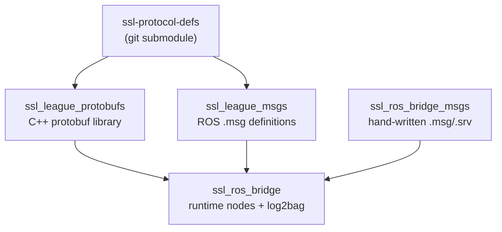
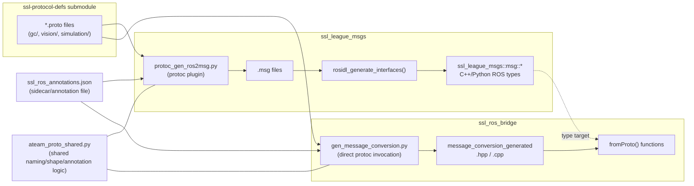
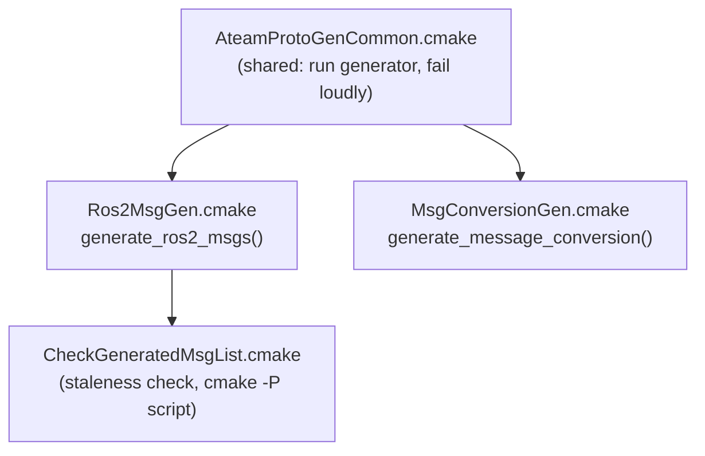
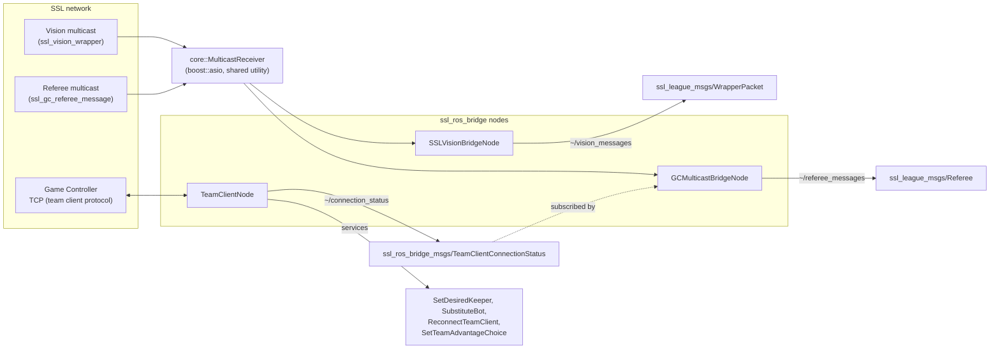

# Architecture

This document describes how `ssl_ros_bridge` is built and how it runs. It is
aimed at contributors working on the packages themselves, not at teams
consuming them — for that, see [README.md](README.md).

## Overview

The repository solves two related but distinct problems:

1. **Translating the SSL league's protobuf definitions into ROS types.**
   `ssl_league_protobufs` and `ssl_league_msgs` do this at build time, via
   code generation. Nothing here runs at runtime.
2. **Bridging live league network traffic into a running ROS system.**
   `ssl_ros_bridge` does this at runtime, via a small set of nodes that
   listen for multicast/TCP traffic and republish it as ROS topics and
   services, using the types and conversion functions produced by (1).

`ssl_ros_bridge_msgs` sits outside both of these: it is a small,
hand-written package of ROS messages/services for `ssl_ros_bridge`'s own
`team_client` node, which has no protobuf equivalent to generate from.

## Package dependency graph

`ssl_league_msgs` and `ssl_league_protobufs` both read the same submodule
independently — one compiles the `.proto` files into C++ protobuf classes,
the other generates ROS `.msg` files from them. `ssl_ros_bridge` depends on
both, plus its own generator that produces the glue between them.

## Code generation pipeline

This is the part of the codebase most contributors will actually touch. Two
independent generators consume the same proto set and the same annotation
file, but produce different output for different consumers.

Both generators independently invoke `protoc` — `protoc_gen_ros2msg.py` runs
*as* a protoc plugin (protoc calls it, feeding it a `CodeGeneratorRequest`
over stdin), while `gen_message_conversion.py` invokes `protoc` itself as a
subprocess to get a `FileDescriptorSet`, then walks that with Python's
`google.protobuf.descriptor_pb2` API. Both approaches end up working from
the same protobuf descriptor model; they just get there differently because
one has to conform to the protoc plugin ABI and the other doesn't.

`ateam_proto_shared.py` exists so the two generators can't drift on shared
concerns: flattening a proto type name into a ROS-legal one, classifying a
field's shape (repeated / oneof member / proto2-optional), and parsing the
annotation file's `fields`/`outputs`/`_skip_types` structure.

### The annotation file

`ssl_ros_annotations.json` (referred to as "the annotation file" or
"sidecar" in code comments) tells both generators to deviate from their
default field-by-field translation for specific messages. It exists because
proto has constructs with no direct ROS equivalent:

- `google.protobuf.Any` fields have no fixed schema — unsupported by
  default; the annotation file must explicitly `"skip": true` them.
- `map<K, V>` fields have no ROS message equivalent — same treatment.
- Self-referential message types (directly or through other messages)
  cannot exist in ROS's fixed-layout structs — `find_type_cycles()` in
  `protoc_gen_ros2msg.py` detects these up front and fails the build with
  the concrete reference chain, unless a `skip` annotation breaks the cycle.
- Several proto fields collapsing into one ROS field (e.g. `x`/`y`/`z` into
  a `geometry_msgs/Point32`) via an `outputs` entry.
- Renaming a field, rescaling a value, or mapping a proto field to
  `builtin_interfaces/Time`/`Duration`.

The annotation format itself is documented in `protoc_gen_ros2msg.py`'s
module docstring — that's the canonical reference, not this file.

### Type translation rules worth knowing

- Proto's `optional` (proto2) and `repeated` are both modeled as ROS arrays
  — proto2-optional as a 0-or-1-element array, `repeated` as an N-element
  array. This is why the README calls out that optional and array fields
  look identical in the generated `.msg` files.
- Proto3 has no `optional`/presence tracking on message-type fields by
  default; a non-oneof message-type field gets a `bool has_<field>`
  sentinel emitted alongside it (`optional_submsg=has_field`, the default
  plugin option — `error` is available to force the schema author to
  address it explicitly instead).
- Enums become `uint8` constants — ROS has no native enum type. A field of
  enum type is likewise `uint8`.
- A `oneof` becomes a `uint8 <name>_case` discriminant, `uint8` constants
  for each arm (named after the arm's field number, stable across
  reordering), and all arms' fields present as regular fields.
- ROS2 message type names must match `^[A-Z][A-Za-z0-9]*$` — no
  underscores. Nested proto messages (`Foo.Bar`) are flattened to
  concatenated names (`FooBar`), unlike protobuf's own generated C++ class
  names, which join nested names with `_` (`Foo_Bar`).

### CMake orchestration

`generate_ros2_msgs()` runs `protoc_gen_ros2msg.py` **twice**, for a
specific reason: `rosidl_generate_interfaces()` needs the full `.msg` file
*list* at CMake configure time (it's a static argument, not something it
can discover later), so the plugin runs once at configure time purely to
learn that list. It's then wired into a build-time `add_custom_command` too,
so that `ninja`/`make` alone regenerates *content* when a `.proto` file or
the plugin script changes — no reconfigure needed for content-only changes.
If the message *list* itself changes (a message added, removed, or
renamed), that does still need a reconfigure; `CheckGeneratedMsgList.cmake`
compares the current generation against a snapshot taken at configure time
and fails the build loudly, telling you to reconfigure, rather than silently
building against a stale file list.

`generate_message_conversion()` (in `ssl_ros_bridge`) doesn't have this
two-phase requirement — nothing downstream needs its output file list known
statically — so it's a plain build-time `add_custom_command`.

### `ssl_league_protobufs`: the odd one out

Unlike the other two, `ssl_league_protobufs` doesn't run one of our Python
generators — it compiles the submodule's `.proto` files straight to C++ via
`protoc --cpp_out`, invoked directly from CMake rather than through the
CMake-bundled `protobuf_generate_cpp()` macro. That macro computes each
generated file's output path relative to `CMAKE_CURRENT_SOURCE_DIR`, but the
submodule's proto files live one directory deeper and cross-import each
other relative to *their own* root — the two roots disagree, and
compilation fails on the cross-includes. Invoking `protoc` directly with one
consistent `--proto_path` avoids the mismatch. See the comments in
`ssl_league_protobufs/CMakeLists.txt` for the full detail; this is a real
CMake/protobuf limitation, not a design choice.

## Runtime architecture

Each bridge node follows the same shape: receive raw bytes off the network,
parse them as a protobuf message, convert with the generated `fromProto()`,
publish the resulting ROS message. `core::MulticastReceiver` is the shared
piece — a small `boost::asio`-based UDP multicast listener used by both
`SSLVisionBridgeNode` and `GCMulticastBridgeNode`, so neither reimplements
socket handling.

`TeamClientNode` is different in shape: it's a long-lived TCP client to the
Game Controller's automated team-control protocol, wrapped in ROS services
rather than a topic publisher, since the interactions it exposes
(substitute a bot, set the desired keeper, reconnect) are request/response,
not a stream.

`log2bag` is not a node — it's a standalone executable that reads an SSL
game log file, runs each record through the same generated `fromProto()`
conversion functions the live nodes use, and writes the result to a rosbag2
bag. It shares conversion code with the runtime bridge but has no ROS graph
presence of its own.

## Testing

`ssl_league_msgs` has a small `pytest` suite (`ssl_league_msgs/test/`)
covering the pure logic in `ateam_proto_shared.py` and
`protoc_gen_ros2msg.py` — name flattening, field-shape classification,
annotation-file parsing, and `find_type_cycles()`'s cycle detection — using
hand-built `descriptor_pb2` messages rather than real `.proto` files, so
these run in milliseconds with no protoc invocation. Everything else is
covered by the standard `ament_lint_auto` suite (`flake8`, `pep257`,
`cpplint`, `cppcheck`, `uncrustify`, `lint_cmake`, `xmllint`, `copyright`)
run via `colcon test`.

`ssl_league_protobufs` and (for two generator scripts) `ssl_ros_bridge`
deliberately don't enforce `ament_copyright` on their own generator
scripts/CMake helpers — see the comments in each package's `CMakeLists.txt`
and `package.xml` for why, and which specific files are excluded.
